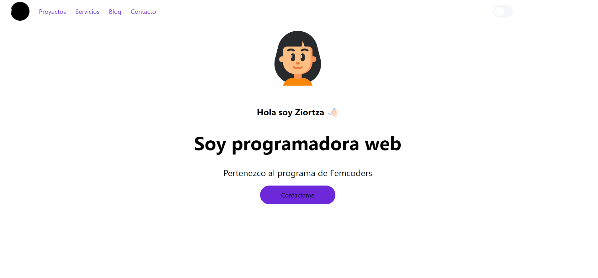

# Ejercicio Tailwind Dark Mode

Crear modo oscuro con Tailwind, un archivo sin clases para realizar como ejercicio.

## Authors

- [@indiakka](https://www.github.com/indiakka)


## Creation

To create this project run

```bash
npm create vite Tailwind

√ Select a framework: » Vanilla
√ Select a variant: » JavaScript

npm i vite

npm install -D tailwindcss postcss autoprefixer

npx tailwindcss init

npm run dev


```


## Deployment

To deploy this project run

```bash
npm i

npm install -D tailwindcss postcss autoprefixer

npx tailwindcss init

npm run dev


```


## Screenshots
#

